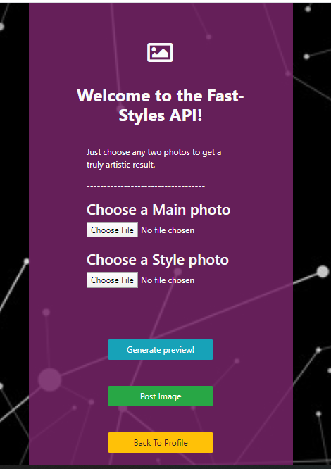

## AI based Photo sharing app.

### Features:
* Create accounts
    * login
    * Sign Up
* User Profiles
* News Feed
* Upload and share photos
* View other peoples profiles
* Like and comment on photos
* Apply Deepdream and Neural Style transfer filters on uploaded photos

### Execution Instructions

#### If running project for first time after a fresh clone:
###### First change directory to the root of the repo and run this command to fetch & install all ExpressJS dependencies (node_modules):
```
npm install
```
###### Then change directory to frontend/photo and again run this command to fetch & install all React dependencies (node_modules):
```
npm install
```
#### For all subsequent runs you only have to do these 2 steps:
###### Change directory back to root and run this command to start ExpressJS server:
```
nodemon server.js
```
###### Change directory back to frontend/photo and run this command to start react app:
```
npm start
```

##### To run ngrok server do as follows:

* first cd to ngrok folder
* run this command once:

```
ngrok authToken YOUR_NGROK_AUTH_TOKEN

```
then open cmd and run this command: 

```
ngrok http 3000 -host-header="localhost:3000"
```
and finally note the forwarding url

### Demo Screenshots

<div align="center">
    
    
    
    
    
</div>
